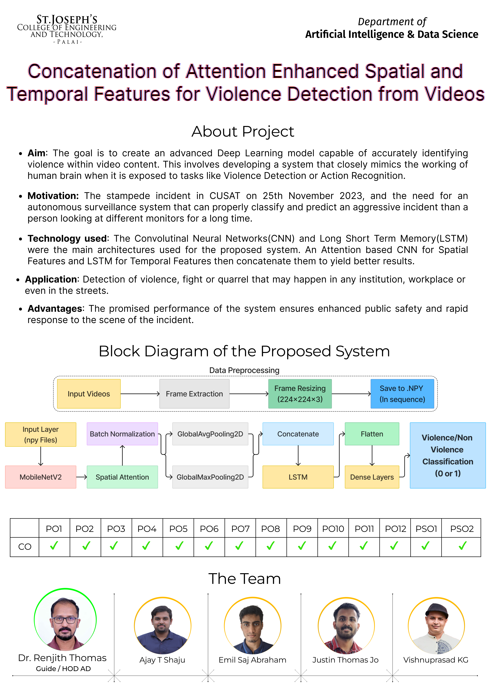

<b><h1 align="center"> *Concatenation of Attention Enhanced Spatial and Temporal Features for Violence Detection from Videos* </h1></b>

_This work is an attempt towards simulating how humans react to violent situations using Convolutional Neural Network (CNN) and Long Short Term Memory (LSTM) architectures._

Dataset: **Hockey Fights**

Dataset Directory Structure:

```
───HockeyFight
    ├───train
    │   ├───Fight
    │   │       Fight_1.avi
    │   │       Fight_2.avi
    │   │
    │   └───No_Fight
    │           No_Fight_1.avi
    │           No_Fight_2.avi
    └───val
        ├───Fight
        │       Fight_1.avi
        │       Fight_1.avi
        │
        └───No_Fight
                No_Fight_1.avi
                No_Fight_2.avi
```

---

## Try it yourself (Windows):

1. Clone the repository:

```
    https://github.com/004Ajay/Main-Project.git
```

2. Navigate to the project directory:

```
    cd Main-Project
```

3. Create a virtual environment

```
    python -m venv <your env name>

    cd <your env name>

    Scripts\activate
```

4. Install the required dependencies

```
    pip install -r requirements.txt
```
_dependecies does not include libraries for the files in the `Experiments Folder`._

5. Download the dataset and arrange as per the structure given above.

6. Start training:

```
    python train.py
```

7. Evaluate your model:

```
    python evaluate.py
```

---

## Documents

* [Final Report (Not Yet)](https://github.com/004Ajay/Main-Project/blob/main/Docs/Phase%201%20Project%20Report.pdf)


---

## Poster



---

## Creators

[Ajay T Shaju](https://github.com/004Ajay) | [Emil Saj Abraham](https://github.com/Emilosaurus) | [Justin Thomas Jo](https://github.com/Juz-Tom-J) | [Vishnuprasad KG](https://github.com/VISHNUPRASAD-K-G)